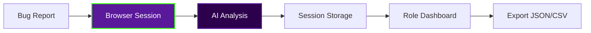

<div align="center">

<!-- Dark Cyber Header -->


<!-- Crazy Cyberpunk Skull Girl Mascot — OVER the header -->


<br/><br/>

<!-- Animated Typing Badge -->
<a href="https://bug-triage-ai-alpha.vercel.app/">
  
</a>

<br/><br/>

<!-- Status Badges -->
<p>
  <a href="https://bug-triage-ai-alpha.vercel.app/">
    
  </a>
  <a href="#">
    
  </a>
  <a href="LICENSE">
    
  </a>
</p>

<!-- Tech Stack Badges -->
<p>
  
  
  
  
  
</p>

</div>

---

## ✨ What It Does

<table>
<tr>
<td width="60%">

**BugTriage AI** is a **database-free**, multi-role bug triage workspace that leverages AI to intelligently analyze, classify, and route software bugs to the right teams — all in real-time.

| Capability | Description |
|:-----------|:------------|
| 📁 **Smart Upload** | CSV upload or raw text paste for instant analysis |
| 🎯 **AI Classification** | Severity, area, priority & confidence scoring |
| 👥 **Auto-Assignment** | Recommends optimal team automatically |
| 💬 **Chat Assistant** | Ask questions about current analysis |
| 📊 **Export** | JSON/CSV workspace export |
| 🎭 **Role Views** | Dedicated dashboards per stakeholder |

</td>
<td width="40%">

```
┌─────────────────────────────────┐
│  🐛 Bug Report Ingested         │
├─────────────────────────────────┤
│  AI Analysis Engine             │
│  ├── Severity: Critical         │
│  ├── Area: Backend API          │
│  ├── Priority: P0               │
│  ├── Confidence: 94%            │
│  └── Duplicate: 12% match       │
├─────────────────────────────────┤
│  ⚡ Auto-Route → DevOps Team    │
└─────────────────────────────────┘
```

</td>
</tr>
</table>

---

## 🎭 Role-Based Workspaces

<div align="center">

| Role | Path | Purpose |
|:----:|:----:|:--------|
| 🧑‍💼 **Manager** | `/roles/manager` | Overview dashboards & team metrics |
| 💻 **Developer** | `/roles/developer` | Code-level bug details & fixes |
| 🧪 **QA** | `/roles/qa` | Test cases & reproduction steps |
| 🔒 **Security** | `/roles/security` | Vulnerability assessment |
| 🚀 **DevOps** | `/roles/devops` | Infrastructure & deployment issues |
| 📋 **Product** | `/roles/product` | User impact & prioritization |

</div>

---

## 🏗️ Zero-Database Architecture

> **No PostgreSQL. No MongoDB. No backend storage.**
> 
> Everything lives in your browser session. Zero config, zero cost, zero persistence concerns.



---

## 🚀 Quick Start

```bash
# Clone the repository
git clone https://github.com/Nithisvaran-M/bug-triage-ai.git
cd bug-triage-ai

# Install dependencies
npm install

# Start development server
npm run dev
```

Then open [http://localhost:3000](http://localhost:3000) 🚀

---

## 🔑 Environment Variables

Create `.env.local` for optional AI provider keys:

```env
# AI Provider Keys (Optional - falls back to heuristic analyzer)
OPENAI_API_KEY=sk-...
ANTHROPIC_API_KEY=sk-ant-...
GROQ_API_KEY=gsk_...
```

> 💡 **Leave blank** to use the built-in heuristic analyzer — no API keys required!

---

## 📦 Deploy to Production

<div align="center">

| Step | Action |
|:----:|:-------|
| 1️⃣ | Create a **public GitHub repository** |
| 2️⃣ | Push this code to GitHub |
| 3️⃣ | Import repo into **Vercel** |
| 4️⃣ | Deploy — **no database variables needed** |
| 5️⃣ | *(Optional)* Set AI keys in Vercel env vars |

<br/>

[](https://vercel.com/new/clone?repository-url=https://github.com/Nithisvaran-M/bug-triage-ai.git)

</div>

---

## 🎬 Demo Highlights

> Perfect for presentations & portfolio showcases:

1. 🏠 **Main Workspace** — Upload & analyze bugs in seconds
2. 🧑‍💼 **Manager View** — High-level metrics & team workload
3. 💻 **Developer View** — Technical deep-dives & stack traces
4. 🧪 **QA View** — Reproduction steps & test coverage
5. 🤖 **Chat Assistant** — Conversational analysis queries
6. 📥 **Export Data** — JSON/CSV workspace snapshots

---

## 📜 License

This project is licensed under the **MIT License** — see the [LICENSE](LICENSE) file for details.

---

<div align="center">

<!-- Dark Cyber Footer -->


<p>
  <b>Built with ❤️ by <a href="https://github.com/Nithisvaran-M" style="color:#39ff14;">Nithisvaran M</a></b>
</p>

<p>
  <a href="https://bug-triage-ai-alpha.vercel.app/">
    
  </a>
</p>

</div>
```

---

e waving header** like a villainess queen overlooking her domain! 🖤💀💚
